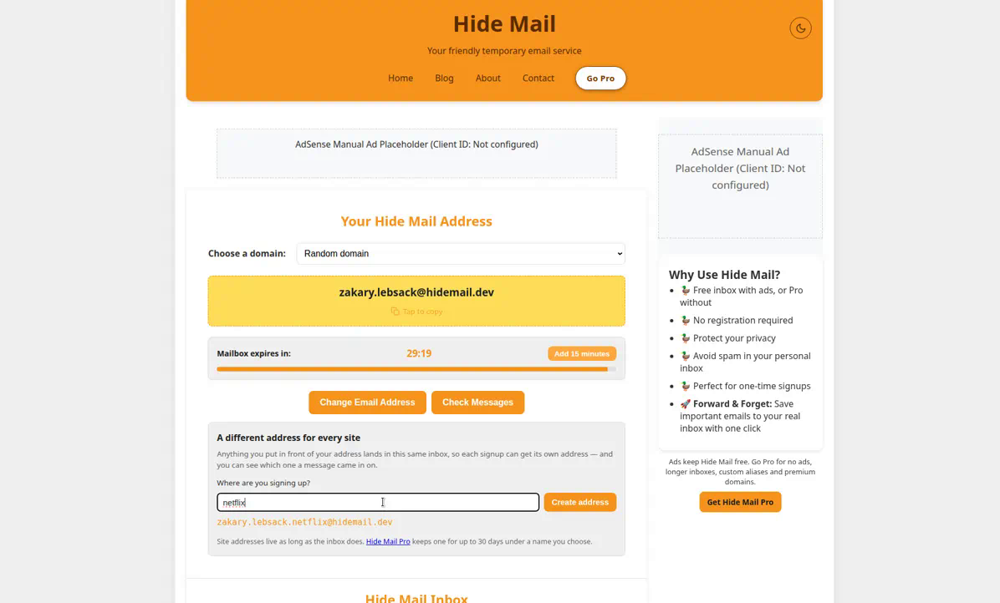
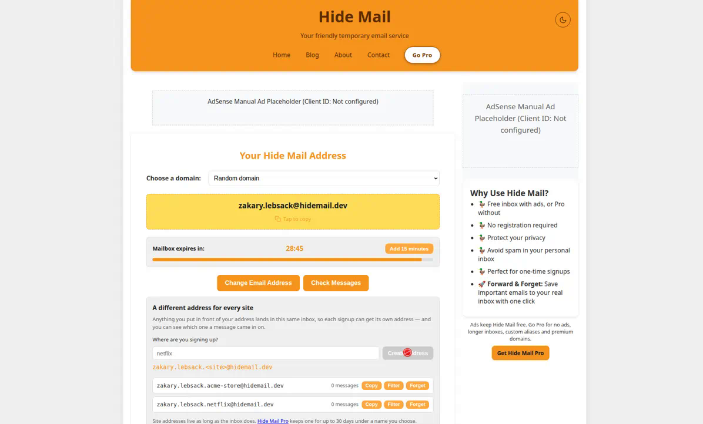
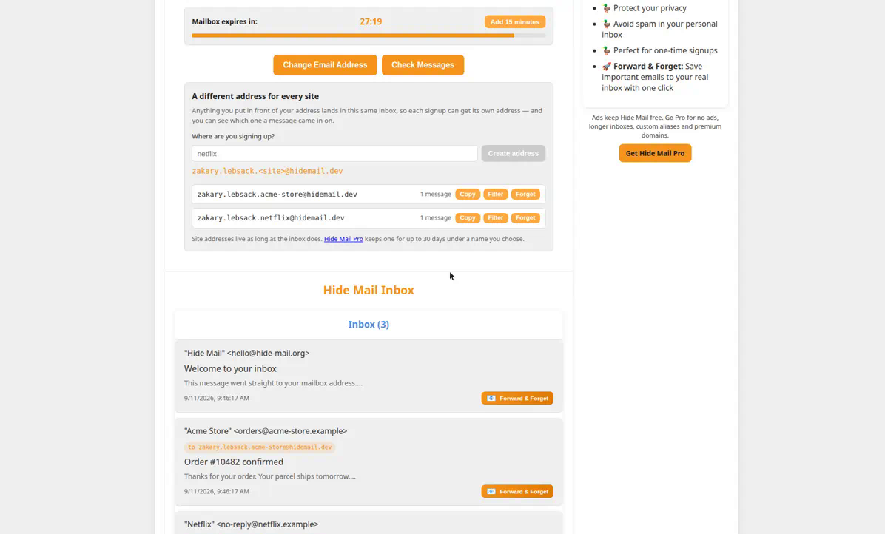
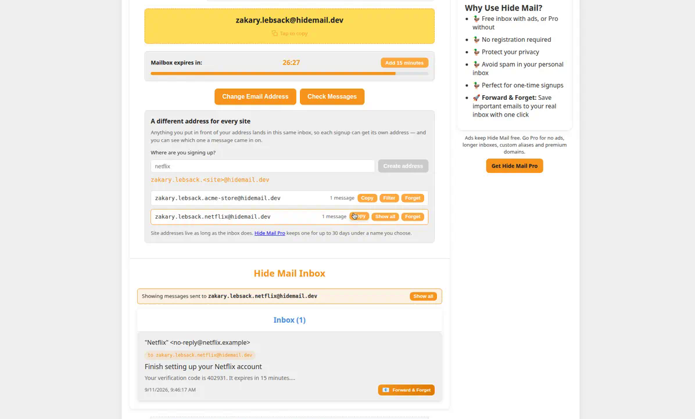
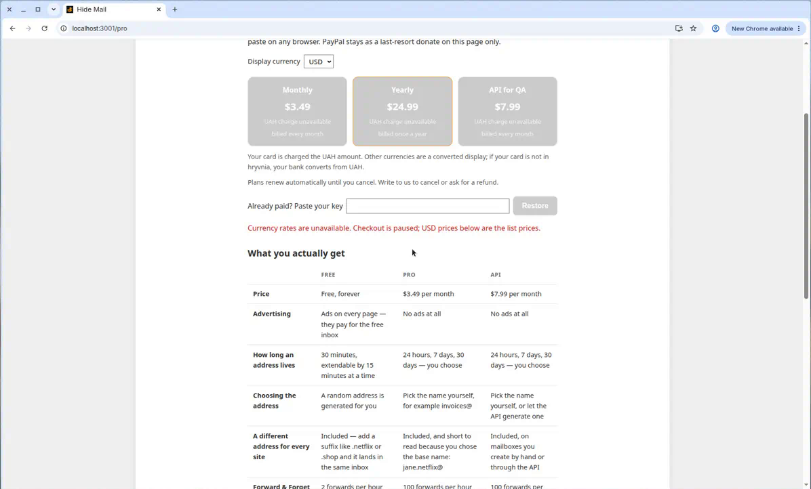
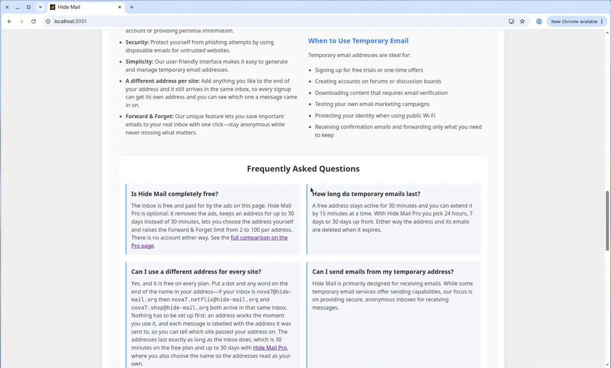

# Site addresses

A mailbox answers to more than its own address. Anything of the form
`<mailbox-local-part>.<label>@<domain>` is delivered into that same mailbox, so a visitor can give
`nova7.netflix@hide-mail.org` to one site and `nova7.shop@hide-mail.org` to the next without
generating — and losing — a second inbox. Nothing has to be registered first: an address works the
moment it is used, because routing is derived from the recipient.

## Who gets it

Free, on every tier. What differs by plan follows from entitlements that already existed:

| | Free | Pro / API |
|---|---|---|
| Site addresses | Included | Included |
| How long one lasts | 30 minutes, the mailbox lifetime | up to 30 days |
| How it reads | random base name, `zakary.lebsack.netflix@` | base name you chose, `jane.netflix@` |

The plan comparison on `/pro`, the home page FAQ and the panel footnote all say so, so nobody has
to guess whether this is a paid capability.

## Why `.` and not `+`

This is plus-addressing with a different separator. `+` is the familiar convention and would make
the resolver a single split, but two things argued against it:

- A lot of signup forms still reject `+` as invalid, so a copied address fails validation and the
  feature goes unused.
- `+tag` is a convention recipients know how to undo — stripping from the `+` to the `@` is a
  one-line normalization, and some senders do it. The message still arrives, but the `deliveredTo`
  attribution that the feature exists for is gone. A dotted label cannot be stripped the same way,
  because a recipient has no way to know where the mailbox name ends and the label begins.

The cost is that dots are legal in a local part and Pro custom aliases use them. That ambiguity is
the only reason the resolver needs longest-prefix matching and the only reason registration needs
an interception guard. A `+` recipient is currently answered `550 Unknown recipient`.

## Routing

Recipients are matched longest-prefix-first by `backend/services/subAddressing.js`, so an address
spelled in full always wins over a sub-address route. Given `john.doe.shop@hide-mail.org` the
candidates are, in order:

1. `john.doe.shop@hide-mail.org` — the address itself, no label
2. `john.doe@hide-mail.org` with label `shop`
3. `john@hide-mail.org` with label `doe.shop`

`recipientResolver` takes the first candidate that is a live mailbox, which is why a Pro mailbox
called `john.doe@` keeps its own mail and still collects `john.doe.shop@`. The candidate list is
capped so one recipient cannot trigger an unbounded number of Redis lookups, and a local part
containing an empty segment produces no sub-address routes at all.

Registration refuses an alias that resolves into a live mailbox, so a dotted alias cannot be used
to intercept somebody else's mail.

## What is stored

Every message records `deliveredTo` (the address the sender actually used, lowercased) and
`siteLabel`. The inbox tags messages with the former and filters on it. Site addresses expire with
the mailbox, because messages inherit the mailbox TTL.

`hidemail_emails_site_addressed_total` counts deliveries that arrived through a site address rather
than the mailbox itself; compare it against `hidemail_emails_stored_total` for adoption.

## Where the code lives

| File | Role |
|---|---|
| `backend/services/subAddressing.js` | Pure routing and label rules |
| `backend/services/recipientResolver.js` | Longest-prefix lookup against live/known mailboxes |
| `backend/services/inboundMailService.js` | Parse, route, store, notify — extracted from `server.js` |
| `src/utils/siteAddress.js` | The same address rules, for composing addresses in the browser |
| `src/services/SiteAddressStore.js` | Which addresses this browser handed out (no accounts exist) |
| `src/components/SiteAddressPanel.js` | The panel under the mailbox |

## Walkthrough

Captured against a local build with real mail delivered through the SMTP listener. The generated
mailbox was `zakary.lebsack@hidemail.dev`, whose dotted local part exercises the longest-prefix
rule.

Typing a site name previews the address it will produce:

Two site addresses handed out from one inbox:

Three messages — two sent to site addresses, one to the mailbox itself — all land in the same
inbox, and the two site-addressed ones are tagged with the address they arrived on:

Filtering the inbox down to one site address:

Documented on `/pro` as included on every tier:

Documented on the home page, with a worked example:

